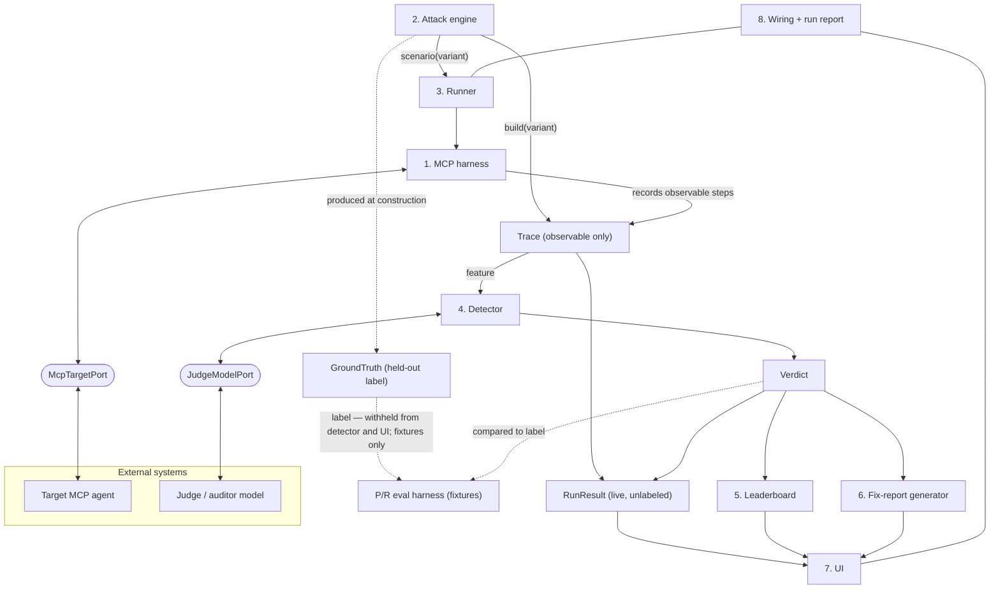

# MCPwn

> Red-team your MCP-tool-using AI agents against the OWASP Top 10 for Agentic Applications (2026) — with a live attack replay, a per-model robustness leaderboard, and engineer-ready fix reports.

## What MCPwn is

MCPwn is a standalone, deployed web app that red-teams an MCP-tool-using agent
against the **OWASP Top 10 for Agentic Applications (2026)**. It runs constructed
attacks against a target agent, detects whether the agent was compromised, and
presents the results three ways:

- **Live attack replay** (the hero) — step through a run's timeline; the
  compromising step is highlighted with the detector's rationale pinned to it.
- **Robustness leaderboard** — per-model results across the attack categories.
- **Findings / fix reports** — engineer-ready remediation write-ups.

The app is model- and target-agnostic: external access sits behind domain-named
ports whose HTTP adapters validate their own credentials lazily, so the offline
app boots with none.

## Current status

**Phase-0, Step-1 — a CI-first "walking skeleton."**

Today the app renders a landing page and nothing more. The point of this step is
to stand up the delivery pipeline first: a minimal deployable app plus the full
quality-gate suite (see [Quality gates](#quality-gates)) wired to run on every
push and pull request, so that every later increment earns a real green check.

The eight feature modules — MCP harness, attack engine, runner, detector,
leaderboard, fix-report generator, HUD UI, and wiring — are being **rebuilt in
disciplined, pushed TDD increments**, module by module, in the order set out in
[`plan.md`](plan.md). Nothing beyond the landing page is claimed as built yet;
this README describes the target architecture and the pipeline that guards it.

## Scope — Core-5 (OWASP Agentic Top 10 2026)

The first wave targets five of the ten categories:

| Code  | Category                                               |
| ----- | ------------------------------------------------------ |
| ASI01 | Agent Goal Hijack                                      |
| ASI02 | Tool Misuse and Exploitation                           |
| ASI04 | Agentic Supply Chain Vulnerabilities                   |
| ASI06 | Memory & Context Poisoning                             |
| ASI10 | Rogue Agents (v1: three bounded single-run signatures) |

## Architecture

Eight modules, two external ports (`McpTargetPort`, `JudgeModelPort`), and a small
data contract that the whole system agrees on.



### Data contract (single source of truth)

The UI renders **observable data only**. The contract is deliberately small:

- **`Trace`** — observable steps only: `{ runId, target, model, category, steps[] }`
  (step types: `attacker`, `agent_reasoning`, `tool_call`, `tool_result`,
  `memory_read`, `memory_write`, `task_complete`). It carries **no labels**.
- **`GroundTruth`** — the **held-out label**: `{ compromised, stepId?, category }`,
  produced at attack construction.
- **`Verdict`** — the detector's output:
  `{ runId, compromised, score, severity, category, rationale, stepId? }`
  (`stepId` is present iff `compromised`).
- **`RunResult`** — a live run's output:
  `{ runId, target, model, category, trace, verdict }` — no ground truth, because
  live runs are unlabeled.

Each attack exposes `build(variant) → { trace, groundTruth }` (for detector
validation) and `scenario(variant) → { taskGoal, environment }` (to drive a live
agent). Types are derived via `z.infer`.

### Ground truth vs. detector — the leakage barrier

This mirrors standard ML anti-leakage practice: never let the model use
information that would be unavailable at prediction time, and keep the label out
of the features. Here the observable `Trace` is the **feature** and the held-out
`GroundTruth` is the **label**. **The detector and the UI see only the Trace; the
`GroundTruth` never reaches the detector.** Precision/recall is measured by
comparing detector verdicts against the held-out ground truth on constructed
fixtures only. Live runs are unlabeled — which is exactly why the detector exists.

## Stack

- **Next.js 16** (App Router) + **React 19** + **TypeScript 6**
  (held; the TS 7 migration is tracked in [`CLAUDE.md`](CLAUDE.md)).
- **Tailwind CSS 4**; UI to be built on **shadcn/ui** over the **Base UI** engine
  with DTCG two-tier design tokens (later phase).
- **ESLint 9** (held; the ESLint 10 bump is tracked) + **Prettier**.
- **Vitest 4** for unit/integration; **Playwright 1.61** + **@axe-core/playwright**
  for e2e and accessibility; **Lighthouse CI** for Core Web Vitals budgets.
- **Neon Postgres** behind a repository port, with an in-memory adapter for tests
  (later phase).
- **Node 22**; deployed on **Vercel**.

## Quickstart

**Prerequisites:** [Node.js 22+](https://nodejs.org/) and npm.

```bash
npm install          # install dependencies (npm ci for a clean, lockfile-exact install)
npm run dev          # start the dev server at http://localhost:3000
```

Run the checks locally:

```bash
npm run lint         # ESLint
npm run typecheck    # tsc --noEmit
npm test             # Vitest unit/integration tests
npm run test:coverage # Vitest with coverage collection
npm run test:e2e     # Playwright end-to-end + accessibility
npm run build        # production build
```

## Scripts

| Script                  | What it does                                                      |
| ----------------------- | ----------------------------------------------------------------- |
| `npm run dev`           | Start the Next.js dev server at http://localhost:3000             |
| `npm run build`         | Produce a production build (`next build`)                         |
| `npm run start`         | Serve the production build (`next start`)                         |
| `npm run lint`          | Lint the repository with ESLint (`eslint .`)                      |
| `npm run typecheck`     | Type-check without emitting output (`tsc --noEmit`)               |
| `npm run format`        | Format all files with Prettier (`prettier --write .`)             |
| `npm run format:check`  | Verify formatting without writing (`prettier --check .`)          |
| `npm test`              | Run the Vitest unit/integration suite                             |
| `npm run test:coverage` | Run Vitest with coverage collection                               |
| `npm run test:e2e`      | Run the Playwright end-to-end suite (with `@axe-core/playwright`) |
| `npm run audit`         | Dependency vulnerability audit (`audit-ci`)                       |
| `npm run prepare`       | Install husky git hooks (runs automatically after `npm install`)  |

## Quality gates

MCPwn is built to a strict Definition of Done (the full list lives in
[`CLAUDE.md`](CLAUDE.md)). The gates below are wired into CI
([`.github/workflows/ci.yml`](.github/workflows/ci.yml)) and run on **every push
and every pull request to `main`**:

- **TDD** — Red → Green → Refactor, following the test pyramid (unit >
  integration > e2e): Vitest for unit/integration, Playwright with
  `@axe-core/playwright` for e2e and accessibility.
- **Coverage** — coverage is collected via `npm run test:coverage`; enforced
  thresholds land in Step 2.
- **Accessibility** — WCAG 2.2 AA via `@axe-core/playwright` in CI, plus role/name
  unit assertions (automation catches roughly 30–50% of issues; not a substitute
  for manual assistive-technology testing).
- **Performance** — Core Web Vitals budgets enforced by Lighthouse CI:
  **LCP ≤ 2.5s, INP ≤ 200ms, CLS ≤ 0.1** at p75.
- **Lint & format** — ESLint and Prettier.
- **Security** — dependency audit (`audit-ci`); Zod validation on all external
  inputs; env-only config (12-Factor III); no secret leakage.
- **Pre-commit / pre-push** — husky + lint-staged + commitlint; the pre-push hook
  runs unit tests and the build. Hooks catch issues early; CI is the safety net.
- **Continuous delivery** — GitHub Actions runs the full pipeline on push and PR;
  `main` is protected and deploys on green to Vercel, with preview deployments for
  pull requests.

## Documentation

- [`CLAUDE.md`](CLAUDE.md) — full architecture, stack, data contract, module map,
  and the Definition of Done.
- [`plan.md`](plan.md) — the phased build order and current rebuild status.
- [`docs/adr/`](docs/adr/) — Architecture Decision Records (Nygard format),
  starting with [ADR-0001](docs/adr/0001-record-architecture-decisions.md).
