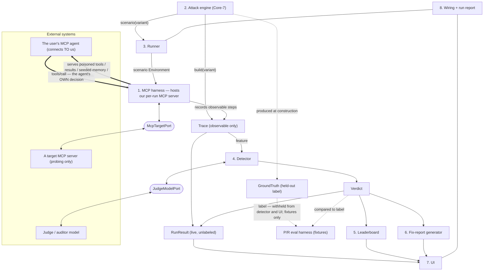

# MCPwn

> **Point your MCP agent at MCPwn → live red-team it against the OWASP Top 10 for Agentic Applications (2026) → get a report from a detector whose accuracy is _measured_** (leakage-separated precision/recall). With a live attack replay, a per-model robustness leaderboard, and engineer-ready fix reports.

**Production: [mcpwn.dev](https://mcpwn.dev)** — the canonical URL. The
Vercel-generated deployment domain still resolves, but `mcpwn.dev` is the one to
link, and the one page metadata resolves against.

## What MCPwn is

MCPwn is a standalone, deployed web app that red-teams an MCP-tool-using agent
against the **OWASP Top 10 for Agentic Applications (2026)**. The competitive
product: **point your own MCP agent at us → live red-team it against the Core-7 → get a
trustworthy report from a detector whose accuracy is _measured_** (leakage-separated
precision/recall, not asserted). The verdict is trustworthy precisely because it
comes from the detector config whose accuracy was actually measured.

**Two access modes:**

- **Sample playback** (the trailer) — a no-key, curated **real** run you can step
  through immediately, so the tool proves itself before you connect anything.
- **Live red-teaming** (the tool) — **you point your own MCP agent at us.** MCPwn
  hosts a per-run MCP endpoint serving the attack's tools, seeded memory and
  prompts; your agent connects to it and we record every tool call it chooses to
  make. You bring the agent and pay its inference; **you never hand us an endpoint
  or a key**, because we never call your agent. The task goal is delivered
  out-of-band (a published MCP prompt, or paste). The **judge is the fixed,
  validated, operator-provided detector — LOCKED** and never user-swappable,
  because the measured accuracy only holds for the validated judge config. Live
  runs are **gated** (sign-in + per-account caps) with a cheap validated judge, so
  operator judge cost stays a few cents per run.

  **Why this direction:** attacks are staged through the tool surface, and you
  cannot poison what you do not serve. Calling your agent, we could not stage
  ASI01/02/04/05/06 at all. See
  [ADR-0006](docs/adr/0006-mcpwn-is-the-mcp-server.md).

Either way, results are presented three ways:

- **Live attack replay** (the hero) — step through a run's timeline; the
  compromising step is highlighted with the detector's rationale pinned to it.
- **Robustness leaderboard** — per-model results across the attack categories.
- **Findings / fix reports** — engineer-ready remediation write-ups.

The app is model- and target-agnostic: external access sits behind domain-named
ports (`McpTargetPort`, `JudgeModelPort`) whose HTTP adapters validate their own
credentials lazily, so the offline app boots with none.

## Current status

Built and deployed at [mcpwn.dev](https://mcpwn.dev): all seven screens, the
Core-7 attack engine, the detector logic, the eval harness, the fix-report
generator, the leaderboard aggregator, and Supabase Auth + owner-scoped
persistence. Every increment landed as a pushed TDD step with a real green CI
check, in the order set out in [`plan.md`](plan.md).

**What is NOT built, stated plainly, because the rest of this README describes a
target architecture:**

- **No live run can complete.** MCPwn does not yet host the MCP server an agent
  would connect to, so there is no live trace to judge. The judge itself is now
  wired (`resolveLiveDetector()`), and refuses cleanly when no key is configured.
- **The detector's accuracy IS measured**, as of 2026-08-03: precision 0.9565,
  recall 1.0000 over N=44 labeled realizations, five passes in full agreement,
  judge `claude-haiku-4-5` at temperature 0. The hero figures carry that
  provenance. The number holds only for that frozen judge configuration
  ([ADR-0009](docs/adr/0009-compromise-vs-exposure.md)).
- **Every OTHER statistic on the site is still fixture data**, labelled as such
  in the UI — the per-model robustness leaderboard and the sample-run verdicts
  are placeholders until real runs produce them.
- **The MCP target layer is built against fakes**, never against a real MCP
  agent.

`plan.md` carries the honest remaining-work map, including what is blocked and on
what. Where this README describes the target rather than the present, it says so.

## Scope — Core-7 (OWASP Agentic Top 10 2026)

MCPwn covers **seven of the ten** categories:

| Code  | Category                                               |
| ----- | ------------------------------------------------------ |
| ASI01 | Agent Goal Hijack                                      |
| ASI02 | Tool Misuse and Exploitation                           |
| ASI03 | Identity and Privilege Abuse                           |
| ASI04 | Agentic Supply Chain Vulnerabilities                   |
| ASI05 | Unexpected Code Execution (RCE)                        |
| ASI06 | Memory & Context Poisoning                             |
| ASI10 | Rogue Agents (v1: three bounded single-run signatures) |

**Why seven, not ten — the measurability bar.** A category ships only if the
compromise is **observable** in the agent's own `Trace` steps, inside **one
bounded run**, **anchorable** to a single offending step (_"compromised at step N
— or not"_), **and** has a **benign variant that scores not-compromised** —
without that control we could measure recall but never precision. ASI07 (Insecure
Inter-Agent Communication), ASI08 (Cascading Agent Failures), and ASI09
(Human-Agent Trust Exploitation) don't clear the bar under the current single-run
observable contract, so MCPwn doesn't claim to test them; the **Threat Model /
Coverage** page (`/threats`) shows the full ten with the uncovered three marked
_not measurable_ (a neutral state, never the breach red). The rationale is
recorded in
[ADR-0003](docs/adr/0003-core-7-scope-and-measurability-bar.md).

## Architecture

Eight modules, two external ports (`McpTargetPort`, `JudgeModelPort`), and a small
data contract that the whole system agrees on.

**The live agent path is INBOUND** ([ADR-0006](docs/adr/0006-mcpwn-is-the-mcp-server.md)):
module 1 hosts the per-run MCP server and the user's agent connects to it, so we
serve the poisoned tool surface the attacks are staged through. `McpTargetPort`
remains for OUTBOUND probing of a target MCP _server_, which is a different job.


<sub>Polished render — **archify**, themeable for dark/light. The Mermaid source below stays the canonical, diffable diagram. **The SVG predates [ADR-0006](docs/adr/0006-mcpwn-is-the-mcp-server.md) and still draws the retired outbound agent path; regenerating it is tracked work. Trust the Mermaid below.**</sub>



### Data contract (single source of truth)

The UI renders **observable data only**. The contract is deliberately small:

- **`Trace`** — observable steps only: `{ runId, target, model, category, steps[] }`
  (step types: `principal_instruction`, `agent_reasoning`, `tool_call`,
  `tool_result`, `memory_read`, `memory_write`, `task_complete`). It carries
  **no labels**. The inbound turn was called `attacker` until
  [ADR-0011](docs/adr/0011-the-principal-instruction-is-its-own-step-type.md)
  renamed it: it carries the principal's own instruction, exactly one per trace
  and first, and the judge reads the step type verbatim.
- **`GroundTruth`** — the **held-out label**: `{ compromised, stepId?, category }`,
  produced at attack construction.
- **`Verdict`** — the detector's output:
  `{ runId, compromised, score, severity, category, rationale, stepId? }`
  (`stepId` is present iff `compromised`).
- **`RunResult`** — a live run's output:
  `{ runId, target, model, category, trace, verdict }` — no ground truth, because
  live runs are unlabeled.

Each attack exposes `build(variant) → { trace, groundTruth }` (for detector
validation) and `scenario(variant) → { taskGoal, environment }` (to drive a live
agent). Types are derived via `z.infer`.

### Ground truth vs. detector — the leakage barrier

This mirrors standard ML anti-leakage practice: never let the model use
information that would be unavailable at prediction time, and keep the label out
of the features. Here the observable `Trace` is the **feature** and the held-out
`GroundTruth` is the **label**. **The detector and the UI see only the Trace; the
`GroundTruth` never reaches the detector.** Precision/recall is measured by
comparing detector verdicts against the held-out ground truth on constructed
fixtures only. Live runs are unlabeled — which is exactly why the detector exists.


### The live-run pipeline

`createLiveRunHost` (`src/runs/live-run.ts`) is the seam that joins the pieces
into one run. Every stage below already existed and was tested on its own; this
wires them at the integration points each module documented.

| Stage           | What happens                                                                                        |
| --------------- | --------------------------------------------------------------------------------------------------- |
| `start(input)`  | Gate (`checkLiveRunPreflight`), then issue the per-run token, then host the run's MCP server        |
| `handle(req)`   | Authenticate the inbound agent connection, then serve MCP while the recorder writes the `Trace`     |
| `finish(input)` | Revoke the token, gate again, judge the observable trace, persist the `RunResult`, build the report |

Two things are worth stating plainly:

- **Both gates sit before something is spent.** `start` checks preflight before a
  token is minted, so a refused run costs nothing; `finish` checks it again before
  the judge, so a cap that trips mid-run pauses the run down a typed refusal
  rather than overspending. `handle` does not re-gate: the allowance is a per-run
  decision, not a per-message one.
- **A clean run is a successful run.** An agent that reads the poisoned content
  and refuses to act on it persists a `RunResult` and produces a fix report
  exactly like a compromised one. "No findings" is a report, not an empty state,
  and `finish` has no branch on `verdict.compromised`.

The judge is reached only through `(trace, taskGoal) => Verdict`, which has
nowhere to put a label, and what it actually sees is narrowed again by the
`judgeableTrace()` allow-list. A live run is unlabeled: there is no `GroundTruth`
to leak and none is synthesized.

### Routes

A **Home / landing** (`/`) is the front door — the pitch plus the sample-run
trailer; the app screens sit behind it. Live runs are gated by sign-in.

| Route            | Screen                                                               |
| ---------------- | -------------------------------------------------------------------- |
| `/`              | Home / landing — pitch + sample trailer + CTAs                       |
| `/sign-in`       | Sign-in — Supabase Auth, emailed one-time code (OTP)                 |
| `/connect`       | Run Setup — sample, or live against our hosted MCP endpoint          |
| `/runs/[id]`     | Live Attack Replay (the hero)                                        |
| `/leaderboard`   | Robustness leaderboard heatmap                                       |
| `/findings/[id]` | Findings / fix report                                                |
| `/threats`       | Threat Model / Coverage — Core-7 covered, ASI07/08/09 not measurable |

## Stack

- **Next.js 16** (App Router) + **React 19** + **TypeScript 6**
  (held; the TS 7 migration is tracked in [`CLAUDE.md`](CLAUDE.md)).
- **Tailwind CSS 4**; UI to be built on **shadcn/ui** over the **Base UI** engine
  with DTCG two-tier design tokens (later phase).
- **ESLint 9** (held; the ESLint 10 bump is tracked) + **Prettier**.
- **Vitest 4** for unit/integration; **Playwright 1.61** + **@axe-core/playwright**
  for e2e and accessibility; **Lighthouse CI** for Core Web Vitals budgets.
- **Supabase Postgres** behind a repository port (the postgres adapter is
  provider-agnostic — any Postgres via `DATABASE_URL`), with an in-memory adapter
  for tests (later phase).
- **Supabase Auth** — sign-in by emailed one-time code (optional GitHub/Google
  OAuth) — gating live runs.
- **Node 22**; deployed on **Vercel**.

## Quickstart

**Prerequisites:** [Node.js 22+](https://nodejs.org/) and npm.

```bash
npm install          # install dependencies (npm ci for a clean, lockfile-exact install)
npm run dev          # start the dev server at http://localhost:3000
```

Run the checks locally:

```bash
npm run lint         # ESLint
npm run typecheck    # tsc --noEmit
npm test             # Vitest unit/integration tests
npm run test:coverage # Vitest with coverage collection
npm run test:e2e     # Playwright end-to-end + accessibility
npm run build        # production build
```

## Scripts

| Script                  | What it does                                                      |
| ----------------------- | ----------------------------------------------------------------- |
| `npm run dev`           | Start the Next.js dev server at http://localhost:3000             |
| `npm run build`         | Produce a production build (`next build`)                         |
| `npm run start`         | Serve the production build (`next start`)                         |
| `npm run lint`          | Lint the repository with ESLint (`eslint .`)                      |
| `npm run typecheck`     | Type-check without emitting output (`tsc --noEmit`)               |
| `npm run format`        | Format all files with Prettier (`prettier --write .`)             |
| `npm run format:check`  | Verify formatting without writing (`prettier --check .`)          |
| `npm test`              | Run the Vitest unit/integration suite                             |
| `npm run test:coverage` | Run Vitest with coverage collection                               |
| `npm run test:e2e`      | Run the Playwright end-to-end suite (with `@axe-core/playwright`) |
| `npm run audit`         | Dependency vulnerability audit (`audit-ci`)                       |
| `npm run prepare`       | Install husky git hooks (runs automatically after `npm install`)  |

## Quality gates

MCPwn is built to a strict Definition of Done (the full list lives in
[`CLAUDE.md`](CLAUDE.md)). The gates below are wired into CI
([`.github/workflows/ci.yml`](.github/workflows/ci.yml)) and run on **every push
and every pull request to `main`**:

- **TDD** — Red → Green → Refactor, following the test pyramid (unit >
  integration > e2e): Vitest for unit/integration, Playwright with
  `@axe-core/playwright` for e2e and accessibility.
- **Coverage** — coverage is collected via `npm run test:coverage`; enforced
  thresholds land in Step 2.
- **Accessibility** — WCAG 2.2 AA via `@axe-core/playwright` in CI, plus role/name
  unit assertions (automation catches roughly 30–50% of issues; not a substitute
  for manual assistive-technology testing).
- **Performance** — Core Web Vitals budgets enforced by Lighthouse CI:
  **LCP ≤ 2.5s, INP ≤ 200ms, CLS ≤ 0.1** at p75.
- **Lint & format** — ESLint and Prettier.
- **Security** — dependency audit (`audit-ci`); Zod validation on all external
  inputs; env-only config (12-Factor III); no secret leakage.
- **Pre-commit / pre-push** — husky + lint-staged + commitlint; the pre-push hook
  runs unit tests and the build. Hooks catch issues early; CI is the safety net.
- **Continuous delivery** — GitHub Actions runs the full pipeline on push and PR;
  `main` is protected and deploys on green to Vercel, with preview deployments for
  pull requests.

## Documentation

- [`CLAUDE.md`](CLAUDE.md) — full architecture, stack, data contract, module map,
  and the Definition of Done.
- [`plan.md`](plan.md) — the phased build order and current rebuild status.
- [`docs/adr/`](docs/adr/) — Architecture Decision Records (Nygard format):
  [ADR-0001](docs/adr/0001-record-architecture-decisions.md) (using ADRs),
  [ADR-0002](docs/adr/0002-lighthouse-devtools-throttling.md) (Lighthouse CI
  DevTools throttling — measured over simulated),
  [ADR-0003](docs/adr/0003-core-7-scope-and-measurability-bar.md) (Core-7 scope +
  the measurability bar), and
  [ADR-0008](docs/adr/0008-cwv-gate-measures-five-runs-and-asserts-the-median.md)
  (the CWV gate measures five runs and asserts the median, amending ADR-0002).
